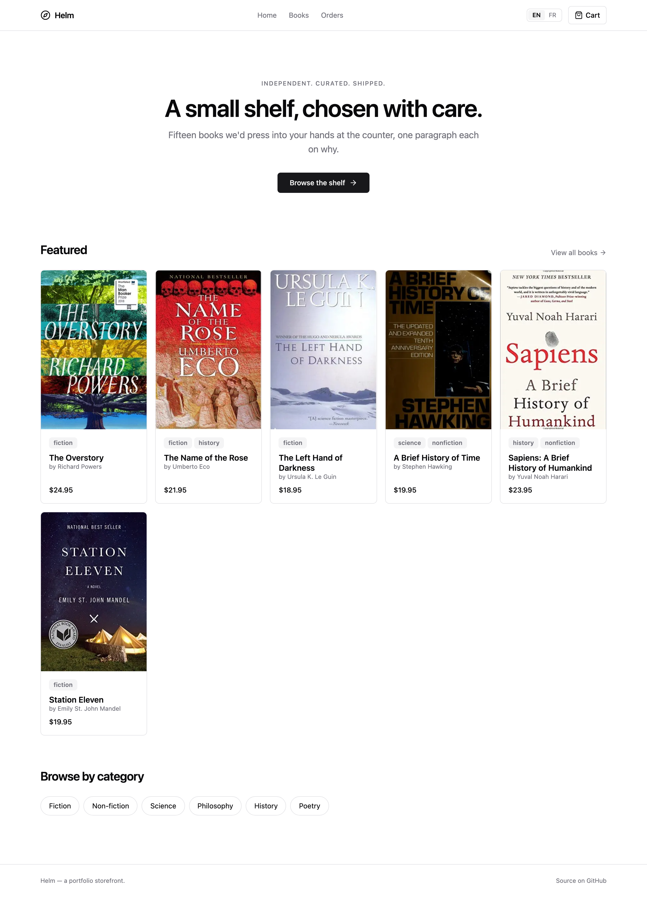
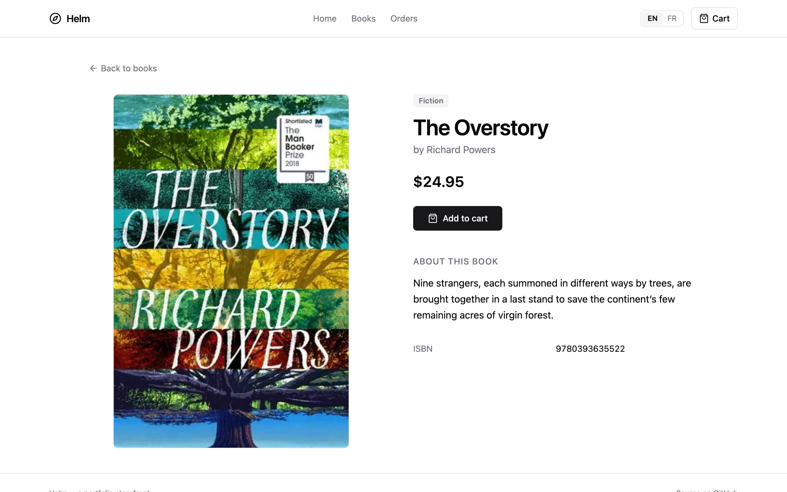
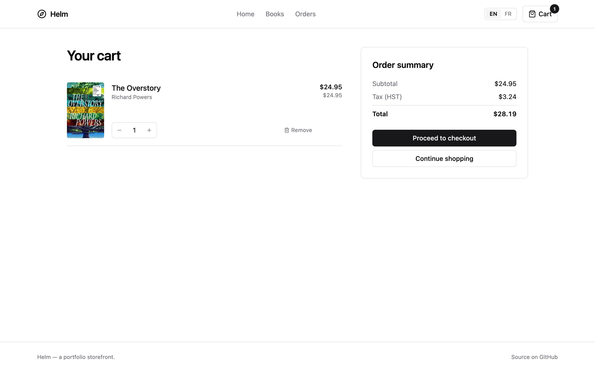

# Helm

> A headless storefront in Next.js 15 — catalog browsing, server-side cart with optimistic updates, Stripe Checkout (test mode), and EN/FR i18n. Built as a focused, production-shape demonstration of how I build modern full-stack storefronts.

Helm is a deliberately small specialty bookshop. ~15 hand-picked titles in a local JSON catalog, a cookie-keyed cart that survives a refresh, an end-to-end Stripe Checkout integration with both webhook and success-page reconciliation, and the kind of SSR / RSC / Server Action discipline you can't fake by reading docs.

This repo exists as proof of the storefront / full-stack side of a typical headless commerce architecture: Contentful CMS feeding a Next.js storefront, with cart and checkout as first-class server primitives.

---

## Table of contents

- [What it does](#what-it-does)
- [How it works](#how-it-works)
- [Tech stack and why](#tech-stack-and-why)
- [Rendering strategy per route](#rendering-strategy-per-route)
- [Prerequisites](#prerequisites)
- [Get a Stripe test key](#get-a-stripe-test-key)
- [Local setup](#local-setup)
- [Testing Stripe webhooks](#testing-stripe-webhooks)
- [Scripts](#scripts)
- [Project structure](#project-structure)
- [Testing](#testing)
- [Internationalisation](#internationalisation)
- [Observability and SEO](#observability-and-seo)
- [What's intentionally out of scope](#whats-intentionally-out-of-scope)
- [Troubleshooting](#troubleshooting)
- [License](#license)

---

## What it does

You open the app, you see a curated shelf of ~15 books:

```
HELM                                            EN | FR    Cart (0)
─────────────────────────────────────────────────────────────────────
                Independent. Curated. Shipped.
              A small shelf, chosen with care.
   Fifteen books we'd press into your hands at the counter,
                 one paragraph each on why.

                       [ Browse the shelf  → ]

  Featured                                            View all  →
  ┌─────────┬─────────┬─────────┬─────────┬─────────┐
  │ Over-   │ Name of │ Left    │ Brief   │ Sapiens │
  │ story   │ the Rose│ Hand    │ History │         │
  │ $24.95  │ $21.95  │ $18.95  │ $19.95  │ $23.95  │
  └─────────┴─────────┴─────────┴─────────┴─────────┘

  Browse by category
  [ Fiction ] [ Non-fiction ] [ Science ] [ Philosophy ] ...
```

Click a category → server-rendered catalog page with a `?category=` query.
Click a book → detail page with one **Add to cart** button.
Click the cart icon → a real cart, persisted across refreshes via a signed cookie.
Click checkout → Stripe Checkout (test mode) with line items hydrated from the database, not the browser.
Pay (`4242 4242 4242 4242`) → bounced back to `/checkout/success`, the cart cookie is cleared, and the Order is upserted in SQLite by either the webhook or the success page — whichever wins; they're idempotent.

Everything also works in French.

### Screenshots

Captured from the running dev server at 1280x800 @2x.

| Page | Screenshot |
| ---- | ---------- |
| Home (EN) |  |
| Catalog |  |
| Book detail |  |
| Cart |  |
| Home (FR) |  |

Checkout and the post-checkout success page are not pictured: both require a live `STRIPE_SECRET_KEY` and render server errors without one. Drop a test key into `.env` and they work exactly like the rest of the app.

---

## How it works

```
                ┌────────────────────────────────────────────────────────────┐
                │                       Helm (Next.js 15)                    │
                │                                                            │
   Browser ───▶ │  /[locale]/                  RSC + static prerender        │
   GET          │  /[locale]/books             RSC + URL-driven filters      │
                │  /[locale]/books/[slug]      RSC + generateStaticParams    │
                │                                                            │
   Click "Add" ─┼─▶ Server Action  ──▶  Prisma (SQLite)  ──▶  revalidatePath │
                │   (signed cart cookie)                                     │
                │                                                            │
                │  /[locale]/cart              RSC, force-dynamic            │
                │      └── client island for ± qty (useOptimistic)          │
                │                                                            │
                │  /[locale]/checkout          Server Action ──▶ Stripe API  │
                │      └─────────────────────────────────────────┐          │
                └────────────────────────────────────────────────┼──────────┘
                                                                  │
                       302 ─────────────────────────────────────  │
                                                                  ▼
                                                         ┌──────────────────┐
                                                         │  Stripe Checkout │
                                                         │  (test mode)     │
                                                         └────────┬─────────┘
                                                                  │
            ┌────────────────────────── webhook ──────────────────┘
            │     POST /api/webhooks/stripe
            │     (raw body, signature verified with whsec_…)
            ▼
   ┌──────────────────┐
   │ Order upsert     │ ◀── /checkout/success also reconciles via API call
   │ (idempotent by   │     so dev works without `stripe listen` running.
   │  session.id)     │
   └──────────────────┘
```

The interesting parts:

- **Server-first everywhere.** Pages that don't need browser state are full RSCs. The only client islands are the language switcher, the add-to-cart button, and the cart line's quantity stepper.
- **Server Actions instead of route handlers.** `addToCart`, `setCartItemQuantity`, `removeCartItem`, and `createCheckoutSession` are server actions called directly from React components. The progressive-enhancement story is built in.
- **Authoritative cart on the server.** The client never sends prices. The cart server action looks up the book in the database (upserting from the catalog snapshot if missing) and uses the stored `unitPriceCents`. This is the difference between a demo and something that doesn't get abused.
- **Optimistic UI for the quantity stepper.** `useOptimistic` updates the rendered quantity immediately; the server action is fire-and-forget and `revalidatePath('/', 'layout')` reconciles the badge.
- **Two paths to the Order row.** The Stripe webhook is the primary; the success page does the same `upsert` as a fallback so local dev works without `stripe listen` running. Both keyed on `stripe_session_id` so racing is harmless.
- **Locale-aware navigation.** `next-intl` provides `<Link>`, `useRouter`, `redirect` wrappers that prefix the current locale automatically. URLs are always like `/en/books/the-overstory` — never ambiguous.

Full design rationale in [`ARCHITECTURE.md`](./ARCHITECTURE.md).

---

## Tech stack and why

| Layer        | Choice                                            | Reasoning                                                                                       |
| ------------ | ------------------------------------------------- | ----------------------------------------------------------------------------------------------- |
| Framework    | Next.js 15 (App Router, RSC, Server Actions)      | Server-first by default; co-located data fetching; matches modern headless commerce shape       |
| Language     | TypeScript strict, `noUncheckedIndexedAccess`     | Catches index-out-of-bounds and null bugs at compile time, not runtime                          |
| Database     | SQLite via Prisma 6                               | Zero-Docker local dev; same Prisma client as Postgres in production (1-line provider change)    |
| Payments     | Stripe Checkout (test mode) + webhook             | The hosted page handles PCI scope; we just verify the webhook and reconcile orders              |
| i18n         | `next-intl` with `localePrefix: 'always'`         | RSC-friendly, file-based message catalogs, locale-aware navigation primitives                   |
| UI           | Tailwind v4 + shadcn/ui (New York, Zinc)          | Owned components rather than a wrapped library; copyable + modifiable                           |
| Validation   | Zod                                               | Single schema for server-action input + checkout payload                                        |
| Tests        | Vitest                                            | Fast, ESM-native, jest-compatible API                                                           |
| Lint/format  | Biome                                             | One binary, one config — replaces eslint + prettier + import sorters                            |
| Package mgr  | pnpm                                              | Strict, fast, disk-efficient                                                                    |
| CI           | GitHub Actions                                    | Lint, typecheck, test, build — fails fast on PRs                                                |

---

## Rendering strategy per route

| Route                                  | Mode                                | Why                                                                       |
| -------------------------------------- | ----------------------------------- | ------------------------------------------------------------------------- |
| `/[locale]/`                           | RSC + static (prerendered)          | No per-user data on the home page. Cache forever.                         |
| `/[locale]/books`                      | RSC + dynamic via search params     | URL is the state. No client JS for the filter chips.                      |
| `/[locale]/books/[slug]`               | RSC + `generateStaticParams`        | 30 pages (15 books × 2 locales) prerendered at build time.                |
| Header (cart badge)                    | RSC, runs on every render           | One SUM(quantity) per request — cheap; correctness > clever caching.      |
| Add-to-cart / qty stepper / lang swap  | Client island                       | Need `onClick`, `useOptimistic`, `useTransition`.                         |
| `/[locale]/cart`                       | RSC, `dynamic = 'force-dynamic'`    | Reads the signed cart cookie — can't be statically cached.                |
| `/[locale]/checkout`                   | RSC, `dynamic = 'force-dynamic'`    | Same; also calls Stripe via a server action submit.                       |
| `/[locale]/checkout/success`           | RSC, `dynamic = 'force-dynamic'`    | Reads `session_id` from the URL, talks to Stripe API.                     |
| `/api/webhooks/stripe`                 | Node route handler, raw body        | Stripe signature verifies against exact bytes — body parser is fatal.     |
| `sitemap.ts` / `robots.ts` / OG image  | Static / edge                       | One per build.                                                            |

---

## Prerequisites

- **Node.js 20.11+** (`node --version`)
- **pnpm 9+** — install with `corepack enable && corepack prepare pnpm@9.15.2 --activate`
- **A Stripe test account** — free, see next section
- *Optional:* the Stripe CLI for local webhook forwarding — `brew install stripe/stripe-cli/stripe`

No Docker required. No Postgres required. The database is a single SQLite file (`prisma/dev.db`) gitignored automatically.

---

## Get a Stripe test key

Stripe Checkout is what actually charges the card. Test mode is free and accepts the magic card number `4242 4242 4242 4242`.

1. **Go to** <https://dashboard.stripe.com> and sign up (no billing details required for test mode).
2. **You'll land in test mode by default** — there's a toggle in the top-left, but leave it on **Test mode**.
3. **Developers → API keys** in the left nav.
4. **Copy the Secret key** — starts with `sk_test_…`. This goes into `.env` as `STRIPE_SECRET_KEY`.
5. **Copy the Publishable key** — starts with `pk_test_…`. (Not currently used at runtime, but kept in `.env.example` for the day we add Stripe Elements.)

For the webhook secret, see [Testing Stripe webhooks](#testing-stripe-webhooks) below — it's a separate value (`whsec_…`) you get from `stripe listen`.

> **Hard guarantee:** the app refuses to start if `STRIPE_SECRET_KEY` begins with `sk_live_`. Live keys do not belong in a portfolio repo.

---

## Local setup

End-to-end, from a fresh clone:

```bash
# 1. Install dependencies.
pnpm install

# 2. Configure environment — paste your sk_test_… into .env.
cp .env.example .env
# then edit .env — set STRIPE_SECRET_KEY at minimum.

# 3. Create the database + tables.
pnpm db:migrate         # first run will prompt for a migration name — pick "init"

# 4. Seed the catalog so cart inserts have foreign keys to point at.
pnpm db:seed

# 5. Run the dev server.
pnpm dev
```

Open <http://localhost:3000>:

- You'll be redirected to `/en` automatically (or `/fr` if your browser prefers French).
- Click **Browse the shelf**, pick a book, add it to the cart.
- Open the cart, change a quantity, watch the optimistic update.
- Click **Proceed to checkout**, fill in the test form, hit **Pay with Stripe**.
- On the Stripe page enter card `4242 4242 4242 4242`, any future expiry, any CVC.
- You'll bounce back to `/en/checkout/success` and the cart cookie is cleared.

> If you change `.env` later, **restart the dev server** — Next.js reads env vars only at startup.

---

## Testing Stripe webhooks

Production gets a webhook from Stripe directly. Locally, use the Stripe CLI to forward events to your dev server.

In one terminal:

```bash
pnpm dev
```

In another:

```bash
stripe listen --forward-to localhost:3000/api/webhooks/stripe
```

On first run it prints a webhook signing secret like:

```
Ready! Your webhook signing secret is whsec_abc123…
```

Paste that into `.env` as `STRIPE_WEBHOOK_SECRET` and restart the dev server. The CLI re-emits any test payments it forwards, so subsequent checkouts will hit the route handler.

> **You don't need `stripe listen` running for the happy path.** The success page reconciles the order by calling `stripe.checkout.sessions.retrieve(...)`. The webhook is the durable, production-shape path; the success page is the dev-friendly fallback. Both upsert on `stripe_session_id`, so they cannot conflict.

---

## Scripts

| Command            | Purpose                                            |
| ------------------ | -------------------------------------------------- |
| `pnpm dev`         | Next dev server (Turbopack)                        |
| `pnpm build`       | Production build                                   |
| `pnpm start`       | Run the production build                           |
| `pnpm test`        | Vitest unit tests                                  |
| `pnpm test:watch`  | Vitest in watch mode                               |
| `pnpm typecheck`   | `tsc --noEmit` — catches type errors without emit  |
| `pnpm lint`        | Biome check (lint + format + import order)         |
| `pnpm lint:fix`    | Biome auto-fix                                     |
| `pnpm db:generate` | Generate the Prisma client from `schema.prisma`    |
| `pnpm db:migrate`  | Create + apply a new migration (dev)               |
| `pnpm db:push`     | Push schema changes without a migration (sketchy)  |
| `pnpm db:studio`   | Open Prisma Studio (visual DB browser)             |
| `pnpm db:seed`     | Mirror the bundled catalog into the database       |

---

## Project structure

```
src/
├── app/
│   ├── layout.tsx                      # minimal root layout
│   ├── globals.css                     # Tailwind v4 + shadcn tokens
│   ├── sitemap.ts                      # sitemap with all locales + books
│   ├── robots.ts                       # disallow cart/checkout
│   ├── opengraph-image.tsx             # static OG image (edge runtime)
│   ├── [locale]/                       # i18n-prefixed routes
│   │   ├── layout.tsx                  # NextIntlClientProvider, header, footer
│   │   ├── page.tsx                    # home — hero + featured strip + categories
│   │   ├── not-found.tsx               # localized 404
│   │   ├── books/
│   │   │   ├── page.tsx                # full catalog + ?category= filter
│   │   │   └── [slug]/page.tsx         # book detail
│   │   ├── cart/page.tsx               # cart view + summary
│   │   ├── checkout/
│   │   │   ├── page.tsx                # shipping form, Stripe session created on submit
│   │   │   └── success/page.tsx        # session reconciliation + clear cookie
│   │   └── account/orders/page.tsx     # placeholder
│   └── api/
│       └── webhooks/stripe/route.ts    # raw-body signature verify + order upsert
├── components/
│   ├── ui/                             # shadcn primitives (button, card, input, label, badge)
│   ├── header.tsx                      # nav + cart badge (RSC)
│   ├── footer.tsx
│   ├── language-switcher.tsx           # client island, useTransition
│   ├── book-card.tsx                   # catalog card (RSC)
│   ├── add-to-cart-button.tsx          # client island, optimistic
│   └── cart-line.tsx                   # client island, useOptimistic qty stepper
├── data/books.ts                       # hardcoded catalog (15 books) + helpers
├── i18n/
│   ├── routing.ts                      # locales + defaultLocale
│   ├── navigation.ts                   # locale-aware Link / useRouter
│   └── request.ts                      # message loader for getRequestConfig
├── lib/
│   ├── db.ts                           # Prisma singleton (HMR-safe)
│   ├── cart-session.ts                 # signed-cookie helpers
│   ├── cart-actions.ts                 # 'use server' — add / set qty / remove
│   ├── cart.ts                         # server-only read side
│   ├── cart-math.ts                    # pure totals + tax + promo (unit-tested)
│   ├── checkout-actions.ts             # 'use server' — Stripe Checkout session
│   ├── stripe.ts                       # SDK client (live-key guard)
│   ├── sentry.ts                       # env-gated stub
│   └── utils.ts                        # cn(), formatPrice()
└── middleware.ts                       # next-intl locale routing

messages/
├── en.json
└── fr.json

prisma/
└── schema.prisma                       # Book, Cart, CartItem, Order, OrderItem, OrderStatus

scripts/
└── seed.ts                             # mirror src/data/books.ts into the DB

tests/
├── cart-math.test.ts                   # totals, tax, promo math
├── catalog.test.ts                     # catalog invariants
├── stripe-webhook.test.ts              # signature verification
└── i18n-routing.test.ts                # locale config

.github/workflows/ci.yml                # lint → typecheck → test → build
```

---

## Testing

```bash
pnpm test
```

Four focused suites:

- **`tests/cart-math.test.ts`** — pure cart arithmetic. Subtotal multiplication, single-pass tax (no per-line rounding errors), tax rounding (half-up via `Math.round`), end-to-end 3-line basket, promo-code matching.
- **`tests/catalog.test.ts`** — invariants on the bundled dataset: unique slugs, unique ISBNs, integer-cent pricing, categories all known, at least one featured book.
- **`tests/stripe-webhook.test.ts`** — verifies the exact signature algorithm the route handler relies on: a correctly-signed body verifies, a tampered body doesn't, a stale timestamp is rejected. This catches the most common regression (someone adding a body parser).
- **`tests/i18n-routing.test.ts`** — guards the locale list and prefix policy so accidentally deleting `fr` or flipping to `as-needed` fails CI instead of silently changing every URL.

CI runs `lint → typecheck → test → build` on every push and PR.

---

## Internationalisation

Helm ships in **English** and **Canadian French**. URLs always carry the locale prefix (`/en/…`, `/fr/…`) — there's no `/books` without a locale, no ambiguity for SEO or analytics.

- All UI strings flow through `t()` from `next-intl`. The catalogs live in `messages/en.json` and `messages/fr.json`.
- The language switcher in the header uses `next-intl`'s `useRouter().replace(pathname, { locale })` so switching keeps you on the same page.
- Currency is formatted with `Intl.NumberFormat` and the active locale (`fr-CA` → `24,95 $`, `en-CA` → `$24.95`).
- Tax rows are labelled **HST** in EN and **TVH** in FR — the exact same labels the CRA uses.

To add another locale:

1. Drop a JSON file beside `messages/en.json` (e.g. `es.json`).
2. Add it to `routing.locales` in `src/i18n/routing.ts`.
3. Update the language switcher to expose it.

---

## Observability and SEO

- **Sentry stub** in `src/lib/sentry.ts`. With `NEXT_PUBLIC_SENTRY_DSN` empty, it's a no-op that logs to stderr in dev. The call sites (`captureException(err, { tags: { surface: 'stripe-webhook' } })`) already match the real SDK's shape — swapping in `@sentry/nextjs` is a one-line change.
- **`sitemap.ts`** generates entries for every static page × locale and every book × locale.
- **`robots.ts`** allows `/`, disallows the cart / checkout paths (per-user, no value to crawlers), and points at the sitemap.
- **`opengraph-image.tsx`** ships an edge-rendered OG image at `/opengraph-image` so social previews don't fall through to the favicon.
- **Per-page metadata** via `generateMetadata` — book detail pages set `og:image` to the book's cover.

---

## What's intentionally out of scope

These would be the natural next slices, deliberately deferred so this repo stays focused:

- **Authentication.** No NextAuth. The `/account/orders` page is a placeholder. The `Order` model is keyed by email, so adding sign-in + filtering orders by `session.user.email` is a small follow-up.
- **Real inventory.** Books are always in stock. There's no `stockCount` column; over-selling is structurally impossible because the catalog is curated and finite, but real stock management is its own surface.
- **Real shipping rates.** Shipping is a flat zero. A real integration would call Canada Post / EasyPost from the checkout server action and stitch the rate into the Stripe Checkout session.
- **Real tax.** A flat 13% stub matches ON HST. Stripe Tax (`automatic_tax: { enabled: true }`) is the production path; deferred to keep the demo free of business-data setup.
- **Apple Pay / Google Pay.** Stripe Checkout supports these out of the box, but only on a verified domain. Not worth the deploy gymnastics for a portfolio.
- **Multi-currency.** Everything is CAD. The schema has a `currency` column on `Book` and `Order`, so the persistence side is ready — the missing piece is rates + a locale-to-currency mapping.
- **Search.** No full-text search. With 15 books in the bundle the catalog filter is enough; with a real CMS the search would route through Algolia or Postgres FTS.
- **CMS integration.** The catalog ships as JSON in the bundle. A real deployment would pull from Contentful or Sanity at build time; the in-bundle shape (`CatalogBook`) is what a CMS adapter would return.
- **Real auth → orders by user.** Already addressed above; the Order model is ready.

---

## Troubleshooting

| Symptom                                                                | Cause                                                                             | Fix                                                                                                                |
| ---------------------------------------------------------------------- | --------------------------------------------------------------------------------- | ------------------------------------------------------------------------------------------------------------------ |
| App refuses to start with `STRIPE_SECRET_KEY looks like a live key`    | A `sk_live_…` key in `.env`                                                       | Use `sk_test_…`. Live keys don't belong in this repo.                                                              |
| Checkout button is disabled / `Stripe is not configured` banner shown  | `STRIPE_SECRET_KEY` is empty                                                      | Paste a `sk_test_…` into `.env` and restart the dev server.                                                        |
| Webhook returns 400 `Invalid signature`                                | Either the wrong `STRIPE_WEBHOOK_SECRET` or a body parser was added to the route  | Confirm the secret matches the one from `stripe listen` and that the route still uses `req.text()` for raw bytes.  |
| Order shows up as PENDING and never flips to PAID                      | Webhook isn't reaching dev; success page handles the fallback                     | Run `stripe listen --forward-to localhost:3000/api/webhooks/stripe`. Or just open the success page — same effect. |
| `pnpm install --frozen-lockfile` fails in CI on first push             | `pnpm-lock.yaml` not committed yet                                                | Run `pnpm install` locally, then commit the lockfile.                                                              |
| `@prisma/client did not initialize yet`                                | Prisma client wasn't generated after install                                      | `pnpm db:generate`.                                                                                                |
| `Cannot find module '../../messages/en.json'`                           | next-intl can't resolve the message catalog                                       | Confirm `messages/en.json` and `messages/fr.json` exist at the repo root and the path in `src/i18n/request.ts` matches. |
| Image domains error in dev                                             | A new book uses an image host not in `next.config.ts → images.remotePatterns`     | Add the host to the array.                                                                                         |
| Cart cookie keeps regenerating between requests                        | `CART_SESSION_SECRET` is empty in production, so each restart invalidates HMACs   | Set `CART_SESSION_SECRET` in `.env` to a long random string (`openssl rand -base64 32`).                           |
| `/api/webhooks/stripe` hangs in dev                                    | `stripe listen` isn't running                                                     | Start the CLI, or skip the webhook and rely on the success page reconciliation.                                    |

---

## License

MIT — see [`LICENSE`](./LICENSE). Attribution appreciated, not required.
